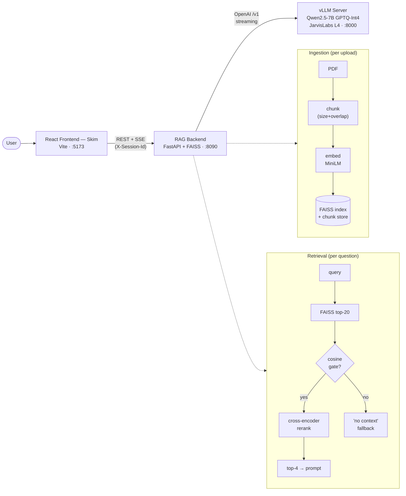
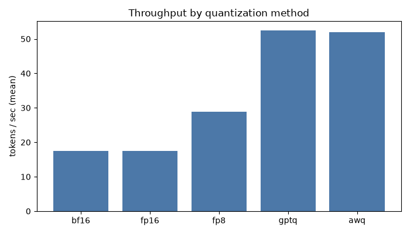
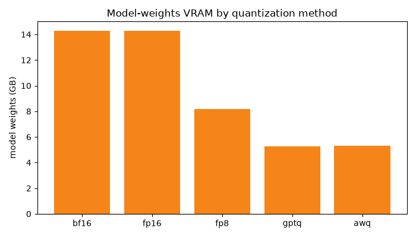

# RAG Chatbot — from LLM quantization experiments to a production RAG product

Chat with your PDFs and get answers that **stream token-by-token** and **cite the exact
pages** they came from — grounded in a self-hosted, quantized **Qwen2.5-7B** served on a
single GPU. This repo tells the whole story end-to-end: **benchmarking quantization
methods → choosing and serving the best one → building the RAG backend → building the
React frontend.**

> **Hero / demo (add to `docs/assets/`):**
> 
> 🎥 **Demo video:** `docs/assets/placeholder-demo.mp4`

<!-- badges placeholder: build · license · python · react -->

---

## Architecture



**Three services, one product:**

| Service | Folder | What it does |
|---------|--------|--------------|
| 🧠 **LLM serving** | [`llm-serving/`](llm-serving) | Quantization experiments + serving Qwen via vLLM |
| ⚙️ **RAG backend** | [`rag-backend/`](rag-backend) | PDF ingestion, retrieval + rerank, streaming answers |
| 💻 **Frontend** | [`skim-frontend/`](skim-frontend) | React chat UI (Skim) |

---

## 1 · Choosing the model — LLM quantization experiments

**Problem:** Qwen2.5-7B in fp16 is **~14 GB** of weights and generates at ~17 tok/s on an
L4 — usable, but slow and leaving little VRAM for KV-cache. Can quantization make it small
*and* fast without wrecking answer quality?

I benchmarked five variants on the **same 20 prompts** (Qwen2.5-7B-Instruct, one NVIDIA L4,
vLLM engine), measuring **TTFT** (responsiveness), **ITL** (stream smoothness),
**throughput**, and **weight size**:

| Variant | Weights (GB) | TTFT (ms) | ITL (ms) | Throughput (tok/s) | E2E (s, ~170 tok) |
|---------|:------------:|:---------:|:--------:|:------------------:|:-----------------:|
| bf16 / fp16 (baseline) | 14.29 | ~108 | 56.7 | 17.5 | 9.9 |
| fp8 | 8.17 | 79.6 | 34.4 | 28.8 | 6.0 |
| **gptq (Int4)** ✅ | **5.27** | **68.3** | **18.9** | **52.5** | **3.2** |
| awq (Int4) | 5.29 | 68.6 | 19.0 | 52.0 | 3.3 |




**Winner: GPTQ-Int4** — **~2.7× smaller** and **~3× faster** than fp16 (5.3 GB, 52.5 tok/s,
3.2 s end-to-end), with the lowest inter-token latency and no visible quality loss on the
sample generations. The smaller footprint also frees VRAM for a larger context window.

→ Full method, harness, per-variant logs and sample outputs: **[`llm-serving/`](llm-serving)**

---

## 2 · Serving — vLLM + a public API

The chosen GPTQ model is served with **vLLM's OpenAI-compatible server** (the fastest path,
Marlin kernels on the L4) on a JarvisLabs L4 instance:

```bash
vllm serve Qwen/Qwen2.5-7B-Instruct-GPTQ-Int4 \
  --served-model-name qwen --quantization gptq_marlin \
  --host 0.0.0.0 --port 8000 --max-model-len 8192 --api-key "$(cat /home/.vllm_key)"
```

This exposes a standard `/v1` API (`/v1/models`, `/v1/chat/completions`) as model **`qwen`**;
the instance's public URL proxies port 8000, so the backend talks to it like any OpenAI
endpoint. The instance ID + URL **change on every pause/resume**, so the full bring-up
procedure (resume → start → find endpoint → health-check) is scripted in
**[`llm-serving/deploy/RESUME_RUNBOOK.md`](llm-serving/deploy/RESUME_RUNBOOK.md)**.
The API key lives only on the instance (`/home/.vllm_key`) and in each service's local
`.env` — **never committed**.

---

## 3 · The RAG backend (FastAPI + FAISS)

The backend turns "a PDF + a question" into a grounded, streamed answer:

- **Ingestion:** PDF → per-page text (pypdf) → recursive character chunking → embed with
  `all-MiniLM-L6-v2` (L2-normalized) → **FAISS** (`IndexFlatIP` = cosine) with per-chunk
  metadata; persisted to disk and scoped per session.
- **Two-stage retrieval:** FAISS returns the top-20 candidates (recall); a **cosine gate**
  decides *"is there relevant context?"* (the no-context fallback); a **cross-encoder
  reranker** (`bge-reranker-base`) then *re-orders* the survivors for precision and keeps
  the best 4. _(Cosine gates presence; the reranker only ranks — cross-encoder scores are
  poor presence-detectors.)_
- **Streaming + validation:** answers stream over **SSE** (`token` → `metadata` → `done`);
  requests are validated by Pydantic (**422** on bad input) and the final metadata payload
  is validated before it's sent — with graceful fallbacks for no-context, LLM errors, and
  timeouts (no hallucinations, never a broken stream).

→ Endpoints, request-flow diagram, schema validation, config: **[`rag-backend/`](rag-backend)**

---

## 4 · The frontend (React — "Skim")

A clean chat UI: drop a PDF, watch the indexing checklist, then ask questions.

> **Screenshots (add to `docs/assets/`):**
> 
> 

- **Live streaming** — tokens appear with a typing caret; the final event shows the
  **source pages**.
- **Session isolation** — a per-tab `X-Session-Id` scopes uploads/retrieval to that session.
- **Persistent per-document chats** — each document keeps its own conversation (saved in
  `sessionStorage`), so switching docs or refreshing doesn't lose history.
- **Markdown rendering** — bold, lists, and code render properly (dependency-free).

→ Design, structure, run instructions: **[`skim-frontend/`](skim-frontend)**

---

## Testing

Three suites, each with a `TEST_PLAN.md` + generated `TEST_RESULTS.md`:

| Suite | Folder | Scope |
|-------|--------|-------|
| **vLLM functional** | [`llm-serving/tests/vllm/`](llm-serving/tests/vllm) | The live vLLM server in isolation (health, params, streaming, concurrency) |
| **Backend (isolated)** | [`tests/backend/`](tests/backend) | Each endpoint + pipeline stage with the **LLM mocked** (deterministic, offline) |
| **Integration** | [`tests/integration/`](tests/integration) | The **seams** between the real services (no mocks) — 15/15 passing |

---

## Repository structure
```
RAG Chat Bot/
├── llm-serving/         # quantization experiments + vLLM serving (+ deploy/ runbook)
│   ├── experiments/     #   one folder per quant method
│   ├── benchmarks/      #   results/ (JSON, logs, charts) + compare.py + load_test.py
│   ├── deploy/          #   start_gptq.sh, RESUME_RUNBOOK.md, setup/benchmark scripts
│   └── app/             #   optional custom FastAPI serving wrapper
├── rag-backend/         # FastAPI + FAISS RAG service
│   ├── app/             #   api/, services/, schemas/, configs/, utils/
│   └── evaluation/      #   offline precision@k / recall@k
├── skim-frontend/       # React + Vite chat UI
├── tests/               # backend/ (isolated, mocked) + integration/ (real seams)
└── docs/assets/         # README images + demo videos (placeholders)
```

## Getting started (run the whole stack)
```bash
# 1. vLLM (Qwen GPTQ) — on JarvisLabs; see llm-serving/deploy/RESUME_RUNBOOK.md

# 2. Backend
cd rag-backend && pip install -r requirements.txt
cp .env.example .env          # set LLM_BASE_URL / LLM_API_KEY (the live vLLM endpoint)
uvicorn app.main:app --port 8090

# 3. Frontend
cd ../skim-frontend && npm install
cp .env.example .env          # VITE_API_BASE=http://localhost:8090
npm run dev                    # http://localhost:5173
```

## Tech stack
**Serving:** vLLM · Qwen2.5-7B-Instruct GPTQ-Int4 · JarvisLabs (L4) ·
**Backend:** FastAPI · Pydantic v2 · FAISS · sentence-transformers (MiniLM) ·
bge-reranker-base · OpenAI SDK ·
**Frontend:** React 18 · Vite ·
**Testing:** pytest · httpx · TestClient.

## Notes
- Secrets (`.env`, API keys, model weights, uploaded PDFs, the FAISS index) are gitignored.
- No auth; chat history is client-side only. Built as a learning/portfolio project.
