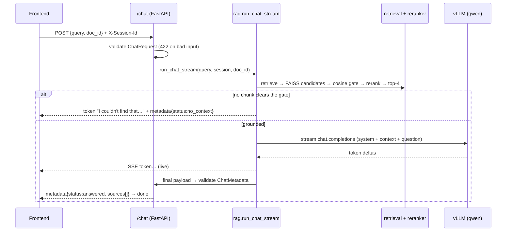

# RAG Backend (FastAPI + FAISS)

The middle layer between the frontend and the vLLM server. It ingests PDFs, retrieves
grounded context with a **two-stage retriever** (FAISS recall → cross-encoder rerank),
and **streams** answers token-by-token with their sources.

## Stack
- **FastAPI** + uvicorn, **Pydantic v2** / pydantic-settings
- **pypdf** for PDF text, a recursive character chunker
- **sentence-transformers `all-MiniLM-L6-v2`** embeddings (CPU), L2-normalized
- **faiss-cpu** — cosine similarity via `IndexFlatIP` on unit vectors, wrapped in
  `IndexIDMap2` for per-document deletes
- **`BAAI/bge-reranker-base`** cross-encoder reranker (loaded once at startup)
- **`openai` SDK** → the vLLM `/v1` server, streaming

## Endpoints
| Method | Path | Purpose |
|--------|------|---------|
| `GET` | `/health` | Liveness + a 1-token probe of the vLLM endpoint |
| `POST` | `/documents/upload` | Multipart PDF → ingest → `{doc_id, filename, chunk_count, page_count}` |
| `POST` | `/documents/upload/stream` | Same, as SSE per-stage progress (`extract`/`chunk`/`index`/`done`) |
| `GET` | `/documents` | List this session's documents |
| `DELETE`| `/documents/{doc_id}` | Remove a document from the index + store |
| `POST` | `/chat` | SSE stream: `token`… → `metadata` → `done` |
| `GET`/`POST` | `/retrieve/test` | Debug: inspect retrieved chunks + scores |

All document/chat routes require an **`X-Session-Id`** header (→ 400 if missing). Every
chunk is tagged with its `session_id`, so a session only ever sees its own documents.

## Pipelines

**Ingestion** (`services/ingestion.py`): save PDF → extract text per page (pypdf) →
recursive character chunking (`chunk_size` / `chunk_overlap`) → embed + L2-normalize
(`services/embeddings.py`) → add to FAISS with metadata `{doc_id, session_id, filename,
page, chunk_idx, text}` (`services/vectorstore.py`). The index + chunk store persist to
`data/index/` and survive restarts.

**Two-stage retrieval** (`services/retrieval.py` + `services/reranker.py`):

```
query
  → embed (MiniLM, L2-normalized)
  → FAISS inner-product search  → top faiss_top_k (20) candidates      [recall]
  → COSINE gate (>= similarity_threshold 0.25)  ── decides "no context?"
  → cross-encoder rerank (bge-reranker-base)     ── reorders for precision
  → keep final_top_k (4)
```

The **cosine** score is the recall/no-context gate (it cleanly separates on-topic from
off-topic); the **reranker** only *re-orders* the survivors. (Cross-encoder scores are
poor presence-detectors — broad/summary questions score near zero — so they must not
gate. See the comment in `config.py`.)

**Answering** (`services/rag.py`): if nothing clears the gate → graceful `no_context`
fallback (no LLM call, no hallucination). Otherwise build a grounded prompt
(`utils/prompt_templates.py`, "answer only from the context") and stream the LLM's tokens.

## Request flow (`POST /chat`)



**Schema validation** (`schemas/`): `ChatRequest` bounds the input (`query` 1–4000 chars,
`top_k` 1–50, `threshold` 0–1) → **422** on violation. The final `ChatMetadata` (status ∈
`answered|no_context|llm_error`, `sources`, `top_score`, `fallback`) is validated **before**
the terminal event is sent; if it fails, or the LLM errors/times out mid-stream, the route
emits a safe fallback instead of a broken response.

## Configuration
All knobs live in [`app/configs/config.py`](app/configs/config.py) and are `.env`-overridable.
Copy `.env.example` → `.env` and fill the vLLM values (the JarvisLabs URL changes each
resume — see `llm-serving/deploy/RESUME_RUNBOOK.md`):

```
LLM_BASE_URL=https://<host>.notebooksn.jarvislabs.net/v1
LLM_API_KEY=<your vllm key>
LLM_MODEL=qwen
```
Key defaults: `chunk_size` 400 / `chunk_overlap` 80, `faiss_top_k` 20, `final_top_k` 4,
`similarity_threshold` 0.25 (cosine gate), `rerank_model` bge-reranker-base.

## Run
```bash
cd rag-backend
pip install -r requirements.txt
cp .env.example .env      # then fill LLM_BASE_URL / LLM_API_KEY
uvicorn app.main:app --port 8090      # loads MiniLM + the reranker once at startup
curl http://localhost:8090/health
```
> First startup downloads the reranker (~1.1 GB) once; it's cached afterwards.

## Tests
- **Isolated backend tests** (mock the LLM): `../tests/backend/` — endpoints + each pipeline
  stage in isolation, deterministic and offline.
- **Integration tests** (real services): `../tests/integration/` — the seams between
  frontend↔backend↔vLLM.

See each folder's `README.md` / `TEST_PLAN.md`.

## Layout
```
app/
  api/        health.py, documents.py, chat.py, retrieval.py (debug), deps.py
  services/   ingestion, embeddings, vectorstore, retrieval, reranker, rag, llm_client
  schemas/    request.py, response.py
  configs/    config.py
  utils/      logger.py, prompt_templates.py
  main.py
data/         uploads/, index/   (gitignored runtime data)
evaluation/   eval_retrieval.py  (offline precision@k / recall@k)
```
